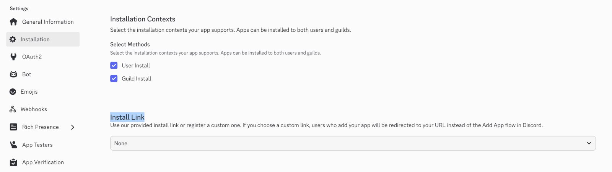
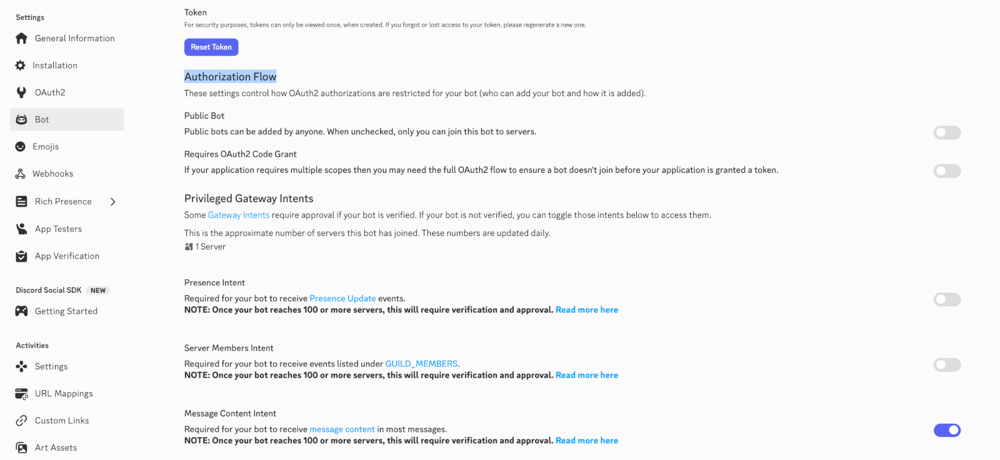
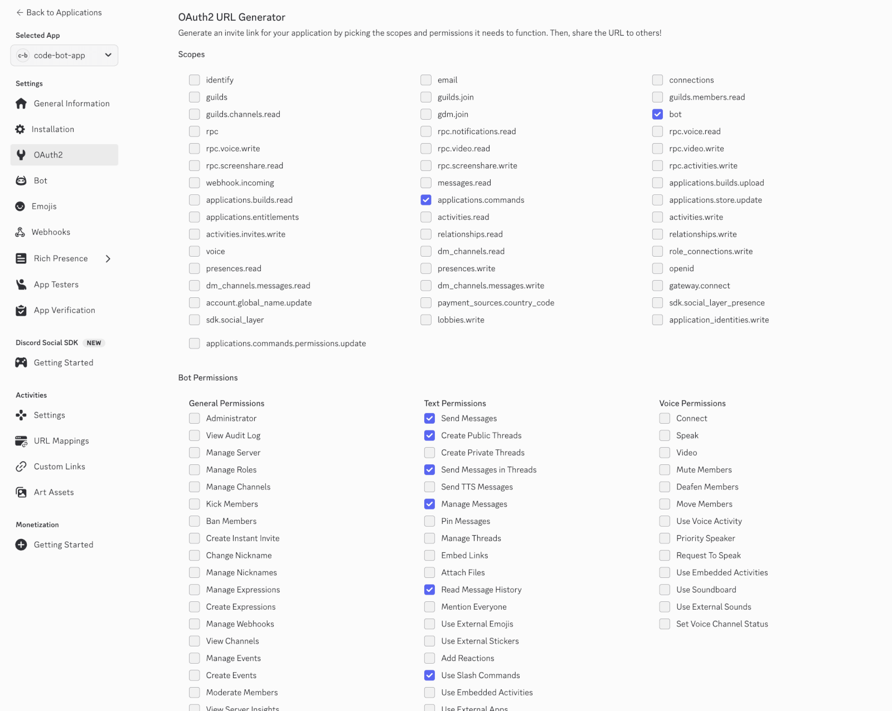

# Discord Agent Bot with Clude Code CLI (for Mac)

Discord から Claude Code CLI を操作する Bot。
メッセージを送るだけで Claude Code と対話でき、スレッドごとに独立したセッションを並列で動かせます。

## 前提条件

- [Bun](https://bun.sh/) v1.0+
- [Claude Code CLI](https://docs.anthropic.com/en/docs/claude-code) (`claude`) がインストール済みで PATH に通っていること
- Discord Bot トークンを取得済みであること

## セットアップ

### 1. Discord Bot の作成

1. [Discord Developer Portal](https://discord.com/developers/applications) で新しいアプリケーションを作成
2. **Installation** > **Install Link** を `None` に設定 (Bot を非公開にするために必要な準備)
3. **Bot** セクションで Bot を追加し、トークンをコピー
4. **Bot** セクションで **Public Bot** を **OFF** に設定
5. **Bot** セクションで **Privileged Gateway Intents** > **Message Content Intent** を有効化
6. **OAuth2** > **OAuth2 URL Generator** で以下の権限を付与して招待 URL を生成:
   - Scopes: `bot`, `applications.commands`
   - Bot Permissions: `Send Messages`, `Create Public Threads`, `Send Messages in Threads`, `Manage Messages`, `Read Message History`, `Use Slash Commands`
7. 生成された URL でサーバーに Bot を招待









### 2. インストール

```bash
git clone https://github.com/ddryo/discord-agent-bot.git
cd discord-agent-bot
bun install
```

### 3. 環境変数の設定

```bash
cp .env.example .env
```

`.env` を編集して必要な値を設定:

```env
# 必須
DISCORD_BOT_TOKEN=your-bot-token
DISCORD_CHANNEL_ID=your-channel-id      # Bot が監視するチャンネルのID

# オプション
DISCORD_USER_ID=your-discord-user-id    # 操作を許可するユーザーID
DEFAULT_CWD=~/Desktop                    # Claude Code のデフォルト作業ディレクトリ
ALLOWED_TOOLS=Bash(ls:*),Read,Glob       # 事前許可するツール（カンマ区切り）
```

`DISCORD_CHANNEL_ID`, `DISCORD_USER_ID`は、Discord の**開発者モードを有効**にしてチャンネル・ユーザーを右クリック → 「IDをコピー」で取得できます。


## 使い方


### Bot 起動

```bash
bun start
```


### 基本操作

指定チャンネルにメッセージを送ると、そのまま Claude に送信されます。コマンドやプレフィックスは不要です。

```
このプロジェクトのディレクトリ構成を教えて
```

Claude の応答は同じチャンネルに投稿されます。会話コンテキストは維持されるので、続けて質問できます。

### スレッド = 独立セッション

スレッドを作成すると、独立した Claude セッションが自動で立ち上がります。メインチャンネルとスレッド、スレッド同士は互いに干渉しません。

**`/new` コマンドでスレッドを作成可能:**

```
/new title:バグ修正 path:~/projects/my-app
```

- `title` (必須): スレッドのタイトル
- `path` (任意): そのセッションの作業ディレクトリ。省略時や指定したパスが見つからない場合は env変数 `DEFAULT_CWD`（デフォルトは`~/Desktop`)となります。


#### `path`指定について
`~` または `/` からはじまる場合は、そのパスがそのまま使用され、それ以外の場合はデフォルトの`DEFAULT_CWD`と連結したパスに変換されます。

例:

- `~/projects/app` → ホームディレクトリからの絶対パス
- `/Users/yourname/projects` → 絶対パスとしてそのまま使用
- `projects/app` → `DEFAULT_CWD/projects/app` に連結
。

### 作業ディレクトリの変更

`/cwd`コマンドを使うことで、作業ディレクトリを変更できます。

作業ディレクトリ切り替えと同時に、セッションもリセットされます。

```
/cwd path:~/projects/another-app
```

`path`の指定方法は `/new` と同じです。


### ツール許可

内部では通常の Claude CLI コマンド（`claude -p`）を実行しているため、グローバル（`~/.claude/settings.json`）または作業ディレクトリ（`.claude/settings.local.json`等）の permission 設定がそのまま引き継がれます。事前に `settings.json` で許可済みのツールはブロックされません。


許可されていないツールを Claude が使おうとすると、Approve / Deny ボタン付きの通知が表示されます。

- **Approve**: そのツールを許可し、処理を自動的に再開します。以降の同セッション内では同じツールが自動許可されます。
- **Deny**: ツールの実行を拒否し、Claude にその旨を伝えます。

`.env` の `ALLOWED_TOOLS` で Bot 側から追加の事前許可を設定することもできます。

### コマンド一覧

テキストコマンド（チャンネル/スレッドに直接入力）:

| コマンド | 説明 |
|----------|------|
| `/clear` | セッションの会話コンテキストをリセット |
| `/status` | セッションの状態を表示 |
| `/tools` | 許可されたツール一覧を表示 |
| `/tools clear` | セッションの動的ツール許可をクリア |
| `/cwd <path>` | 作業ディレクトリを変更 |
| `/exit` | セッションを終了 |

スラッシュコマンド（Discord の入力欄から選択）:

| コマンド | 説明 |
|----------|------|
| `/clear` | セッションの会話コンテキストをリセット |
| `/status` | セッションの状態を表示 |
| `/tools list` | 許可されたツール一覧を表示 |
| `/tools clear` | セッションの動的ツール許可をクリア |
| `/new` | 新しいスレッドとセッションを作成 |
| `/cwd` | 作業ディレクトリを変更 |

### セッションの永続化

セッション情報は自動的に保存されます。Bot を再起動しても、前回の会話コンテキストを引き継いで対話を続けられます。

## ライセンス

MIT
